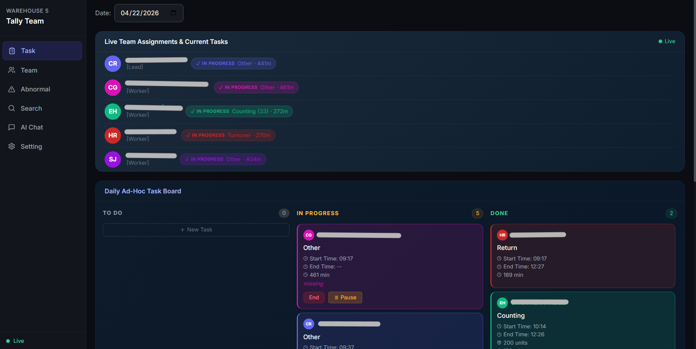
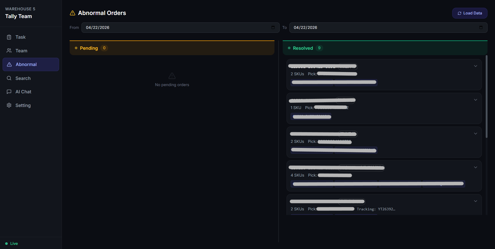
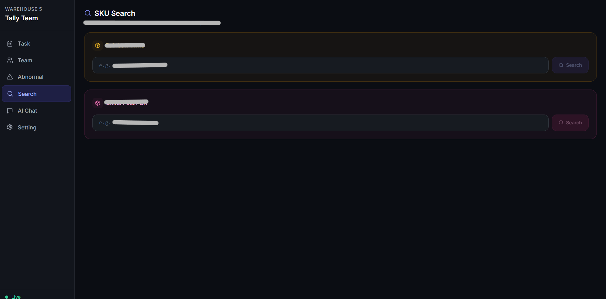
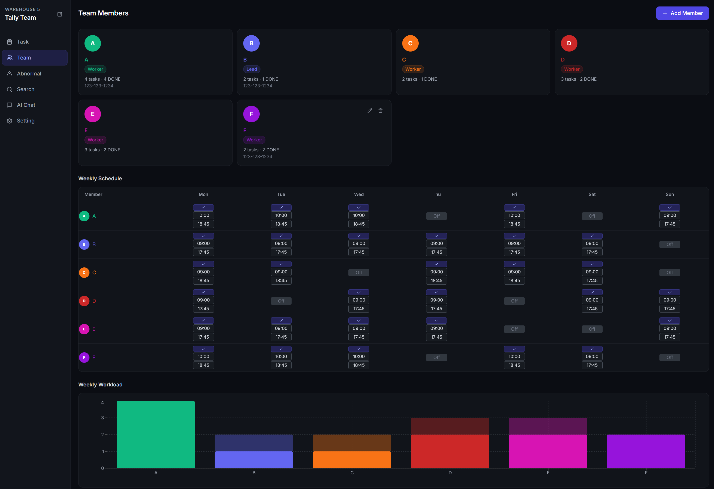
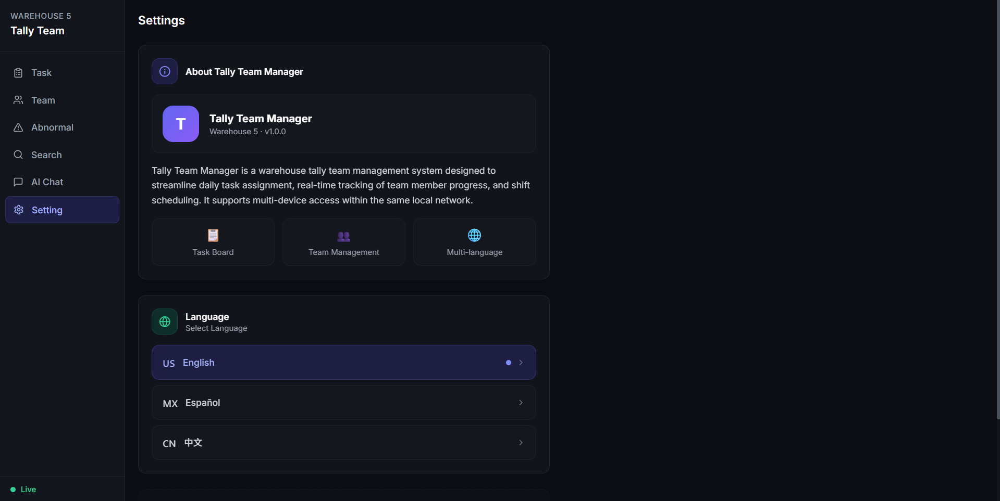

# Tally App — Warehouse Team Management System

> A web application integrating Rainbow WMS API and China Post PDA API to manage warehouse team daily tasks, exception order processing, and inventory queries.

---

## Tech Stack

| Layer | Technology |
|-------|------------|
| Frontend | React 18 + TypeScript + Vite |
| UI | Multi-language (EN/ES/ZH) + Dark theme |
| Backend | Python 3.14 + FastAPI + SQLAlchemy |
| Database | SQLite (wms.db / tally.db) |
| AI | SiliconFlow DeepSeek-V3 (optional) |
| Browser Automation | Playwright (auto token refresh) |

---

## Quick Start (Demo Mode — runs out of the box)

```bash
# Double-click the launch script
start.bat
```

Then open:
- Frontend: http://localhost:5175
- API docs: http://localhost:5172/docs

Demo mode uses pre-seeded mock data — no API keys or credentials needed.

---

## Features

### 1. Task Board
- Manage inventory counting tasks by status: Todo / In Progress / Done
- Built-in timer with pause and complete controls
- Member schedule display (Mon–Sun)

### 2. Exception Order Processing
- Pulls exception orders from Rainbow WMS
- Filter by status: Pending / Resolved / All
- Two-step flow: scan SKU + manual verification

### 3. SKU Scan Search
- Enter a SKU code to query: basic info, inventory distribution, historical location changes
- Calls Rainbow WMS + China Post PDA APIs simultaneously

### 4. AI Assistant (optional)
- Natural language queries over tasks and exception data
- Powered by SiliconFlow DeepSeek-V3

---

## Screenshots

| Feature | Preview |
|---------|---------|
| Task Board |  |
| Exception Order Processing |  |
| SKU Scan Search |  |
| SKU Detail |  |
| AI Assistant |  |
| Member Schedule |  |
| Settings |  |

---

## Project Structure

```
main-Tally-APP/
├── backend/
│   ├── app/
│   │   ├── routers/          # FastAPI routers
│   │   │   ├── members.py      member management
│   │   │   ├── tasks.py         task management
│   │   │   ├── settings.py      schedule settings
│   │   │   └── chat.py          AI assistant
│   │   ├── models.py          SQLAlchemy models
│   │   ├── database.py        DB connection
│   │   └── main.py            FastAPI entry point
│   ├── wms/
│   │   ├── rainbow_api.py     Rainbow WMS API (Mock mode)
│   │   ├── cp_api.py          China Post PDA API (Mock mode)
│   │   └── router.py          WMS router aggregator
│   ├── wms.db                 SQLite — WMS business data (mock)
│   ├── tally.db               SQLite — members / tasks / schedules
│   └── seed.py                tally.db initial seed data
├── frontend/
│   ├── src/
│   │   ├── api/               # API client
│   │   ├── components/        # UI components
│   │   ├── pages/             # Page views
│   │   ├── i18n/              # Multi-language config
│   │   └── types/             # TypeScript types
│   ├── public/                # Static assets
│   ├── index.html
│   ├── package.json
│   └── vite.config.ts
├── seed_mock_data.py          # Reset wms.db with mock data
└── start.bat                  # One-click launch script
```

---


## Switching to Live APIs (optional)

To connect to real WMS systems:

### 1. Create `.env` from the template

```bash
cp .env.example .env
```

### 2. Fill in real credentials

```env
RAINBOW_TOKEN=your_rainbow_token
CP_PHPSESSID=your_php_session_id
SILICONFLOW_API_KEY=your_siliconflow_key
```

### 3. Disable Mock mode

Change `MOCK_MODE = True` to `MOCK_MODE = False` in:

```python
# backend/wms/rainbow_api.py
# backend/wms/cp_api.py
```

---

## Reset Mock Data

To regenerate mock data at any time:

```bash
python seed_mock_data.py
```

---

## Requirements

- Node.js 22+
- Python 3.14+
- Windows (launch script is a `.bat` file)
